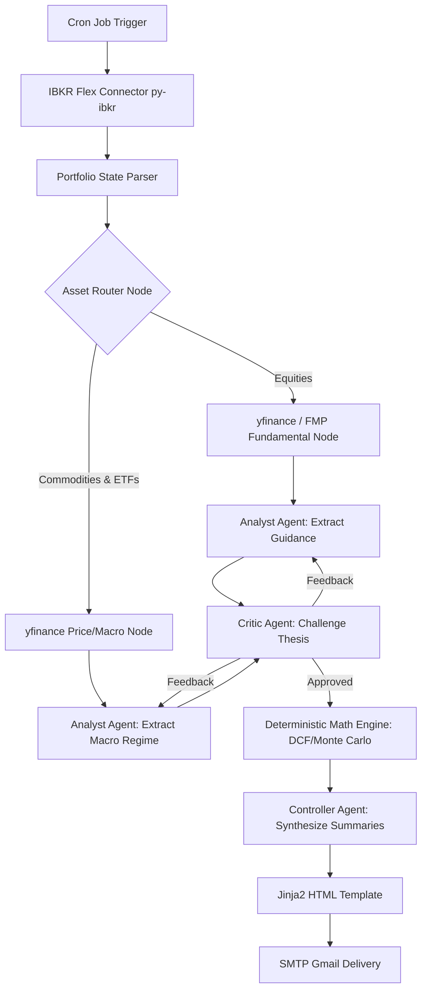

# Satellite Portfolio AI Engine - Technical Specifications

## Objective
To build a read-only, autonomous financial analysis pipeline that monitors a satellite portfolio (0-5% of total wealth), discovers new high-expected-return opportunities, and generates a comprehensive weekly email report.

## Architectural Decisions

### 1. Orchestration: LangGraph
**Decision:** The system utilizes LangGraph to manage the multi-agent workflow.
**Rationale:** LangGraph enforces a strict Directed Acyclic Graph (DAG) state machine, providing deterministic execution, precise state passing via `AgentState` objects, and eliminating context rot for a standalone background cron job.
**Discarded Alternative:** Antigravity native "Manus Protocol" (`.swarm/` directory). While file-based state management is robust for IDE-integrated agents, it is unnecessary overhead for a headless, programmatic Python cron job.

### 2. Market Data Ingestion: yfinance with FMP Fallback
**Decision:** `yfinance` serves as the primary market data source, supplemented by Financial Modeling Prep (FMP) as a fallback and validation check for U.S. equities.
**Rationale:** `yfinance` provides completely free, extensive coverage for non-yielding commodities (e.g., Gold, Crude Oil) and global ETFs, which are heavily restricted on FMP's free tier. FMP is retained for reliable historical SEC structured data where applicable.
**Discarded Alternative:** Exclusive reliance on FMP (too restrictive for commodities on the free tier) or custom scraping scripts.

### 3. Portfolio Ingestion: Native HTTP (requests) + Pydantic Validation
**Decision:** The system utilizes Python's native `requests` library to directly interact with the Interactive Brokers Flex Web Service, requesting and parsing a CSV format. A local caching layer (`.ibkr_cache.csv`) is implemented to provide rate-limit resilience.
**Rationale:** IBKR Flex Queries are notoriously prone to aggressive rate-limiting (`ErrorCode 1001`). Implementing a custom polling loop allows for graceful fallback to a local cache, ensuring the weekly cron job never crashes due to temporary IBKR timeouts. By pairing the standard `csv` parser with our strict Pydantic `PortfolioItem` model, we achieve the exact same robust type-checking and data validation without relying on incomplete third-party wrappers.
**Discarded Alternative:** `py-ibkr` (It only supports `Trades` and `CashTransactions`, lacking the necessary `OpenPositions` model, and strictly expects XML, failing on CSVs), `ibflex` (legacy XML parser, overkill when CSV is available), or live IB Gateway socket connection (requires a running daemon, breaking the serverless/cron architecture).

### 4. Agent Tooling and Validation: Pydantic AI
**Decision:** All Large Language Model (LLM) interactions are governed by Pydantic AI.
**Rationale:** It strictly enforces structured JSON outputs conforming to predefined schemas, ensuring the LLM does not hallucinate arbitrary data formats and seamlessly integrates with the deterministic Python logic.

### 5. Valuation Methodologies (Ensemble Approach)
**Decision:** The system strictly separates data extraction from mathematical calculation to mitigate non-deterministic mathematical risk.
*   **Equities:** Having an LLM arbitrarily generate probability parameters introduces non-deterministic mathematical risk. To mitigate this, Monte Carlo distributions are anchored to historical asset volatility calculated deterministically in Python. The LLM's sentiment score is used solely to shift the mean of the distribution for a parameterized Discounted Cash Flow (DCF) model.
*   **Commodities:** Similar to equities, mathematical execution is decoupled from the LLM.
    *   **Industrial Metals (e.g., Lithium):** The LLM extracts demand vectors from industry reports. A deterministic Python algorithm calculates the structural deficit and compares the spot price against the marginal cost of production.
    *   **Precious Metals (e.g., Gold):** The LLM extracts qualitative macro-sentiment indicators (e.g., central bank accumulation, fiat debasement). Python then maps these scores against historical correlation matrices to generate a probability-weighted target price band.

### 6. Email Delivery
**Decision:** Python's native `smtplib` combined with `email.message`, authenticated via a standard Gmail App Password.
**Rationale:** Simplest, most reliable implementation for a personal reporting script running locally or on a lightweight VPS.

## Engineering Standards

*   **Test-Driven Development (TDD):** The core logic (math, ingestion) must be built using pure Python functions with 100% test coverage before AI integration.
*   **Dependency Injection:** LLM calls must be isolated via dependency injection to facilitate robust mocking in the `unittest` suite.
*   **Data Minimization:** Adherence to "Rule of 2"; the system must never have write-access to the broker for autonomous trade execution.

## System Architecture

The following sections detail how the components of the multi-agent system interact, orchestrated by LangGraph.

### Workflow Graph

### Component Breakdown

#### 1. Data Ingestion Layer
*   **Cron Job Trigger:** The entry point. A simple shell script or `cron` configuration that executes the main Python orchestrator script once a week (e.g., Friday afternoon).
*   **IBKR Flex Connector (`py-ibkr`):** Authenticates with the Interactive Brokers API using the configured Token and Query ID, requesting the end-of-day portfolio statement.
*   **Portfolio State Parser:** Uses Pydantic to cleanly type-cast the XML/CSV output from IBKR into a standardized list of holdings (Ticker, Asset Class, Quantity, Cost Basis).
*   **Asset Router Node (LangGraph):** The first conditional edge in the LangGraph state machine. It evaluates each asset's class and routes it to the appropriate data ingestion node.
*   **Fundamental Node (Equities):** For stocks, it pulls deep historical data (10-Ks, P/E, CapEx) utilizing `yfinance` with a fallback to `FMP`.
*   **Macro Node (Commodities/ETFs):** For macro assets, it pulls recent price trends and broader macro-economic news indicators from `yfinance`.

#### 2. Agentic Reasoning Layer (Pydantic AI + Gemini)
*   **Analyst Agent:** The primary "Generator" model. Depending on the asset class, it reads either the fundamental text (extracting Base/Bull/Bear parameters for CapEx and Growth) or the macro text (classifying the current economic regime into Expansion, Slowdown, etc.). It outputs strict JSON parameters.
*   **Critic Agent:** The adversarial "Reviewer" model. It takes the Analyst's output and cross-references it against historical data and the `thesis_log.json` to detect "thesis drift" and over-optimism.
    *   *Feedback Loop:* If the Critic finds the Analyst's parameters mathematically absurd or unsupported by the evidence, it rejects the state and sends it back to the Analyst node with explicitly defined corrections.
    *   *Approval:* Once the Critic is satisfied with the margin of safety, it approves the state payload and passes it forward.

#### 3. Mathematical Core
*   **Deterministic Math Engine:** Pure Python algorithms (utilizing `numpy` and `pandas`) completely devoid of LLM prompt logic. It ingests the JSON parameters from the approved Agent State.
    *   For equities, it runs a parameterized **Discounted Cash Flow (DCF)** within a **Monte Carlo** simulation to produce a statistical bell curve of the intrinsic value.
    *   For commodities, it runs a correlation-based macro-regime check.

#### 4. Delivery Layer
*   **Controller Agent:** The final LLM node. It ingests the raw numerical outputs (Intrinsic Value, Current Price, Margin of Safety) and generates two clear, concise summary sentences per asset.
*   **Jinja2 HTML Template:** A robust, responsive HTML template engine that formats the summaries, portfolio delta, and statistical distributions into a clean visual report.
*   **SMTP Gmail Delivery:** Dispatches the final HTML payload securely to the user's inbox using a pre-configured Gmail App Password.
